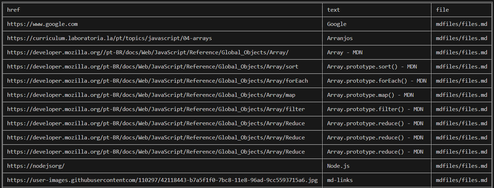
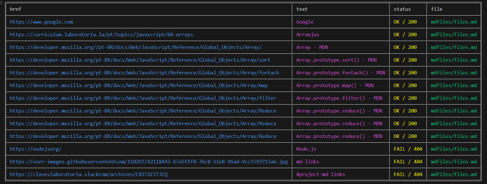
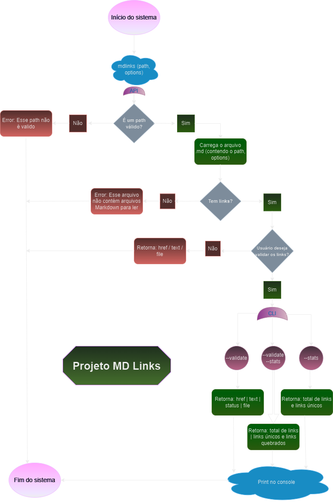

# Markdown Links

## Índice

* [1. Resumo do projeto](#1-resumo-do-projeto)
* [2. Instalação](#2-instalação)
* [3. Guia de uso](#3-guia-de-uso)
* [4. Fluxograma](#4-fluxograma)
* [5. Tecnologias utilizadas](#5-tecnologias-utilizadas)
* [6. Desenvolvedora](#6-desenvolvedora)

***

## 1. Resumo do projeto

O MDLinks é uma biblioteca para extrair e validar links em arquivos Markdown. Ele permite que você analise os links presentes em seus arquivos Markdown e verifique se eles estão funcionando corretamente ou se algum deles está quebrado.


## 2. Instalação

Para usar o MDLinks em seu projeto, você precisa tê-lo instalado. Você pode instalá-lo globalmente ou como uma dependência do seu projeto.

Para instalar o MDLinks, você pode executar o seguinte comando no terminal:

`Terminal`: npm -y <br>
`Terminal`: npm i md-links-carol-protasio
- cria um arquivo index.js e importa as funções: 
```js
const { fileRead, 
        validateLinks, 
        statsLinks,
        extractLinks,
        readRecursion 
        } = require('md-links-carol-protasio')

``` 


- IMPORTANTE: Após a instalação, certifique de ter um arquivo com extenção .md com links dentro.

Para usar este pacote como uma API, você deve usar require (CommonJS) o módulo mdLinks(path, options) depois de instalá-lo, no arquivo que você quiser. Este módulo tem dois argumentos:

Observe que esta API é uma promessa pendente, portanto, você deve usar .then e .catch após o módulo para resolvê-la.

- path: para o caminho relativo ou absoluto onde você precisa inserir o caminho do seu arquivo ou diretório que deseja analisar.
- options: Um objeto onde você pode escolher entre as opções padrão, falso e verdadeiro:
    - A opção padrão (e falso) não valida os links encontrados, apenas retorna o href (URL), text e file de cada link.
    - A opção verdadeiro valida os links, retornando também as propriedades status (HTTP request-response) e ok ('fail' ou 'ok') com base na validação anterior.

A API retorna uma Promise pendente, portanto, você deve utilizar .then e .catch para resolver a Promise e tratar os resultados ou erros.

Essa abordagem permite que você utilize o pacote de forma mais flexível e integrada ao seu código, podendo personalizar as opções conforme suas necessidades específicas.

## 3. Guia de uso

### A API (Application Programming Interface)

A API (Application Programming Interface) do MDLinks permite que outros módulos ou projetos utilizem as funcionalidades do pacote MDLinks programaticamente, ou seja, através de chamadas de funções no código.

A principal função da API é a fileRead, que recebe como parâmetro um caminho para um arquivo ou diretório e retorna uma Promise com os resultados dos links encontrados. O retorno é uma lista de objetos contendo as informações de cada link, como o href (URL), o text (texto do link) e o file (caminho do arquivo em que o link foi encontrado).

 - `Comando`: mdlinks <./path/to/file.md>

* Se o arquivo não contiver links, ele mostrará o seguinte Error: Esse arquivo não contém links para ler.

* Caso contrário, ele retornará uma lista de links encontrados no arquivo ou diretório especificado, exibindo as informações: href | text | file



### CLI (Command-Line Interface)

O CLI (Command Line Interface) do MDLinks permite que os usuários utilizem o pacote diretamente através do terminal de comando, sem a necessidade de escrever código para chamar as funções. O CLI é executado através do comando mdlinks, seguido de opções e argumentos.

#### -- validate: Opção para verificar se os links são válidos, ou seja, se estão acessíveis ou não. Retorna informações adicionais sobre o status de cada link.

Exemplo de uso com a opção --validate



- `Comando`:  mdlinks <./path/to/file.md> --validate

* Retorna uma lista de links encontrados no arquivo ou diretório especificado, exibindo as informações: 
   ---   href | text | status | file   ---

#### -- stats: Opção para obter estatísticas dos links encontrados no arquivo. Retorna o total de links e o número de links únicos.

Exemplo de uso com a opção --stats:

  

- `Comando`: mdlinks <./path/to/file.md> --stats


* Retorna o total de links e links únicos encontrados no arquivo ou diretório especificado.

#### --validate --stats: Opção para obter estatísticas dos links com a validação dos mesmos. Retorna o total de links, o número de links únicos e o número de links quebrados (não acessíveis).

Exemplo de uso com as opções --validate --stats:


- `Comando`: mdlinks <./path/to/file.md> --validate --stats

* Retorna o total de links, links únicos e links quebrados (com status de erro) encontrados no arquivo ou diretório especificado.

Lembrando que, para utilizar o CLI do MDLinks, o pacote deve estar instalado globalmente ou como uma dependência de desenvolvimento no projeto.

Essas são as principais funcionalidades e opções disponíveis na API e no CLI do pacote MDLinks, permitindo aos usuários verificar e validar os links em arquivos Markdown de forma fácil e eficiente.


## 4. Fluxograma



## 5. Tecnologias utilizadas:

###     

##

## 6. Desenvolvedora

### ✨ Carol Protásio 
<a href="https://www.linkedin.com/in/carol-protasio/" target="_blank"></a> 

***